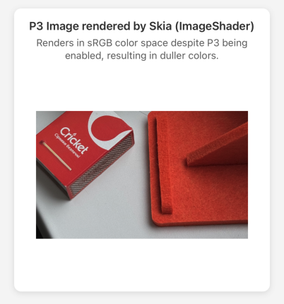
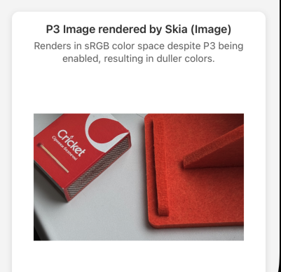

# React Native Skia P3 Color Space Issue Demo

This project demonstrates the P3 color space rendering issue in React Native Skia, specifically related to [Issue #3350](https://github.com/Shopify/react-native-skia/issues/3350).

## 🎯 Problem Description

The issue reports that while onscreen Canvas supports Display P3 color space on iOS (since v2.0.1), offscreen surfaces created with `MakeOffscreen()` are limited to sRGB. However, after testing with this demo, **P3 color space is not working correctly in both onscreen and offscreen Skia rendering**.

## 🔍 Issue Analysis

Based on testing with a P3 color profile image, we found:

1. **React Native Image**: ✅ Renders correctly with P3 color profile and displays vibrant colors as expected
2. **Skia ImageShader**: ❌ Renders in sRGB color space despite `colorSpace='p3'` being set, resulting in duller colors
3. **Skia Image**: ❌ Renders in sRGB color space despite `colorSpace='p3'` being set, resulting in duller colors

## 📱 Screenshots

### Screen 1: React Native Image (Correct P3 Rendering)


* Renders correctly with P3 color profile and displays vibrant colors as expected.*

### Screen 2: Skia ImageShader (Incorrect sRGB Rendering)


* Renders in sRGB color space despite P3 being enabled, resulting in duller colors.*

### Screen 3: Skia Image (Incorrect sRGB Rendering)


* Renders in sRGB color space despite P3 being enabled, resulting in duller colors.*

## 🛠 Technical Details

### Environment
- **React Native Skia**: ^2.2.10
- **Platform**: iOS (P3 displays)
- **Image**: P3 color profile JPEG

### Code Implementation

The demo implements three different rendering approaches:

#### 1. React Native Image
```tsx
<Image 
  source={{ uri: imageUri }} 
  style={styles.image}
  resizeMode="contain"
/>
```

#### 2. Skia ImageShader
```tsx
<Canvas style={styles.canvas} colorSpace='p3'>
  <Group>
    <Fill />
    <ImageShader
      image={skiaImage}
      fit="contain"
      rect={{ x: 0, y: 0, width: 300, height: 300 }}
    />
  </Group>
</Canvas>
```

#### 3. Skia Image
```tsx
<Canvas style={styles.canvas} colorSpace='p3'>
  <SkiaImage
    image={skiaImage}
    fit="contain"
    x={0}
    y={0}
    width={300}
    height={300}
  />
</Canvas>
```

## 🏗 Project Structure

```
src/
├── hooks/
│   ├── useImageLoader.ts      # Image loading logic
│   └── useImageSaver.ts       # Image saving with offscreen rendering
├── components/
│   ├── ImageDisplay.tsx       # React Native image display
│   ├── CanvasDisplay.tsx      # Skia canvas display
│   └── SaveButton.tsx         # Save button component
├── styles/
│   └── appStyles.ts           # App-wide styles
└── utils/
    ├── handlers/
    │   └── ImageEffectHandler.ts  # Offscreen rendering handler
    └── shaders/
        └── shader.ts              # Simple passthrough shader
```

## 🚀 Getting Started

1. **Install dependencies**:
   ```bash
   npm install
   ```

2. **Run on iOS**:
   ```bash
   npx expo run:ios
   ```

3. **Test the demo**:
   - Observe the color differences between the three rendering methods
   - Use the "Save Image" button to test offscreen rendering
   - Compare the saved image with the onscreen rendering

## 🔬 Testing Results

| Rendering Method | P3 Support | Color Accuracy | Notes |
|------------------|------------|----------------|-------|
| React Native Image | ✅ Working | Vibrant P3 colors | Correct implementation |
| Skia ImageShader | ❌ Not Working | Dull sRGB colors | `colorSpace='p3'` ignored |
| Skia Image | ❌ Not Working | Dull sRGB colors | `colorSpace='p3'` ignored |
| Offscreen Rendering | ❌ Not Working | Dull sRGB colors | Limited to sRGB |

## 📋 Related Issues

- **Primary Issue**: [#3350 - Add Display P3 color space support for offscreen surfaces](https://github.com/Shopify/react-native-skia/issues/3350)
- **Related Discussion**: [#3149](https://github.com/Shopify/react-native-skia/issues/3149)
- **Previous PR Attempt**: [#3165](https://github.com/Shopify/react-native-skia/pull/3165) (not merged)
- **Onscreen P3 Implementation**: [#3153](https://github.com/Shopify/react-native-skia/pull/3153) (working since v2.0.1)

## 🎯 Expected Behavior

The `colorSpace='p3'` parameter should:
1. Enable P3 color space rendering for onscreen Skia Canvas
2. Support P3 color space for offscreen surfaces created with `MakeOffscreen()`
3. Maintain color consistency between onscreen and offscreen rendering

## 🐛 Current Behavior

- `colorSpace='p3'` parameter is ignored in Skia rendering
- All Skia rendering falls back to sRGB color space
- Significant color mismatch between React Native and Skia rendering
- Offscreen rendering is limited to sRGB regardless of settings

## 💡 Proposed Solution

As suggested in [Issue #3350](https://github.com/Shopify/react-native-skia/issues/3350), add optional configuration parameter to `MakeOffscreen()`:

```typescript
const surface = Skia.Surface.MakeOffscreen(width, height, {
  colorType: ColorType.RGBA_F16, // or RGBA_8888
  colorSpace: 'display-p3' // or 'srgb' for backwards compatibility
});
```

## 🤝 Contributing

This is a demo project for issue reproduction. For contributing to the actual fix, please refer to the [React Native Skia repository](https://github.com/Shopify/react-native-skia) and [Issue #3350](https://github.com/Shopify/react-native-skia/issues/3350).

---

**Issue Reference**: [Shopify/react-native-skia#3350](https://github.com/Shopify/react-native-skia/issues/3350)
